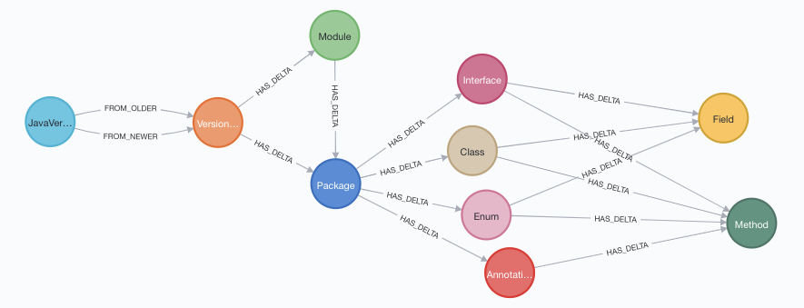

= Spring Data Neo4j application with Neo4j Aura Free instance

This is an example application using Spring Data Neo4j and connecting to a Neo4j Aura free tier database. You can recreate this project using the following steps:

1. Create a Neo4j Aura free instance using https://dev.neo4j.com/aura[dev.neo4j.com/aura^].

Creating an instance will require creating a user account with Neo4j, but there are no costs for either the account or to create a free tier database instance. Please record the password you create with your instance. It is not shown to you again and will be needed in order to connect the application to the database.

[start=2]
2. Once the database instance is created, load the data in the database.

From the main page in Neo4j Aura, there should be a blue button next to the instance. Click this to open Neo4j Browser. At the top of Neo4j Browser window, there is a text input. Copy/paste the contents of the java-version-load.cypher script into the text input and click the play button on the right.

[start=3]
3. Once data is loaded, clone this project and open in your preferred IDE.

4. Open this project's application.properties file and update with your database's credentials.

The first 3 lines in the application.properties are for URI, username, and password. From the Aura console (not Neo4j Browser window), there should be details about your instance, including a line for `Connection URI`. The username is defaulted to `neo4j`, and the password was shown to you when you created the instance.

== Data set

Data is maintained and pulled from a https://raw.githubusercontent.com/marchof/java-almanac/[Github repository^].
It contains all published Java versions and compares the changes between any pair of versions in a diff.
Each diff contains the lists of individual changes (packages, methods, etc) between each version.

An example of the data model is shown below.

For this project, we are only concentrating on the `JavaVersion` and `VersionDiff` entities.
The rest of the entities are mapped and returned in another https://github.com/JMHReif/sdn-jdk-versions[Github project^] (work-in-progress).

//Add presentation link when available

== Resources
* https://dev.neo4j.com/aura[Neo4j Aura console^]
* https://neo4j.com/developer/aura-cloud-dbaas/[Neo4j Aura developer guides^]
* https://docs.spring.io/spring-data/neo4j/docs/current/reference/html/#reference[Spring Data Neo4j documentation^]